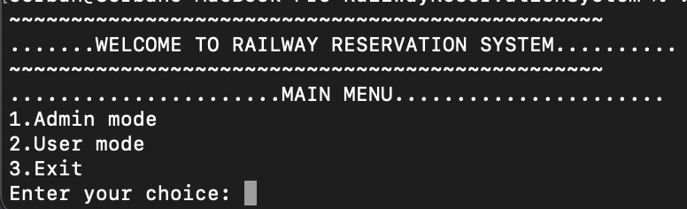
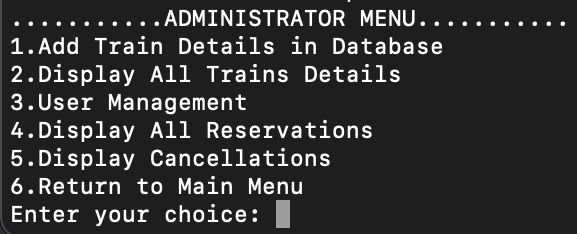
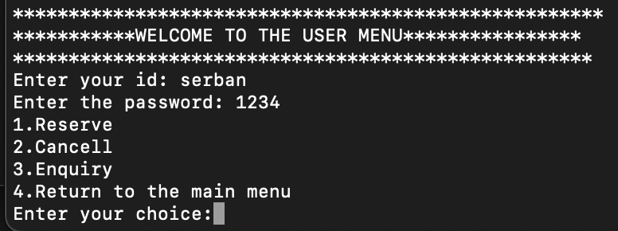

# RailwayReservationSystem

This is a simple train ticket reservation system implemented in C++.

## Description

This project provides a reservation system for train tickets. It has two main modes: administrator mode and user mode. Administrator mode allows adding train details, managing users and displaying reservations. User mode allows users to create accounts, make reservations and cancel reservations.

## Features

- Adding train details to the database.
- Detailed display of trains in the database.
- User management.
- Show reservations and cancellations.

## Usage

1. Compile and run the program using `g++ main.cpp` and `./a.out`.
2. In the main menu, choose the appropriate mode (Admin mode or User mode).
3. Follow the on-screen instructions for each available option.

